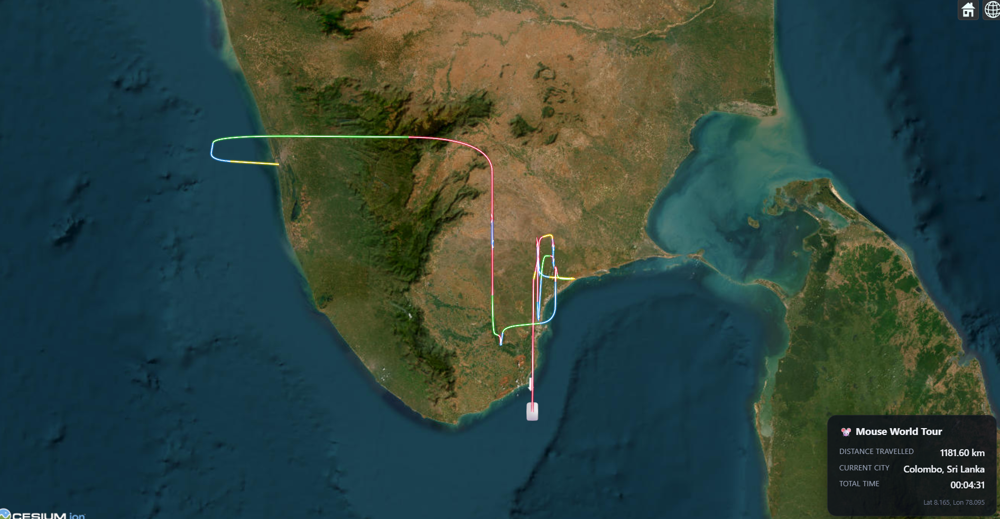
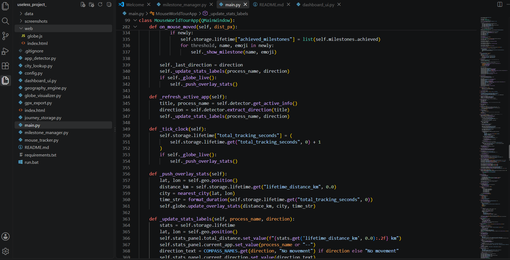

# Mouse World Tour


## Basic Details
### Team Name: USELESS


### Team Members
- Team Lead: ADITHYA NANDA GOPAL - MODEL ENGINEERING COLLEGE
- Member 2: MOHAMMED YASEEN - MODEL ENGINEERING COLLEGE

### Project Description
What if your cursor wasn't moving across a screen, but travelling through the multiverse?In Mouse World Tour, every mouse movement contributes to a virtual journey across Earth-616, direction is decided by whatever application window you happen to be using. Your route is drawn live on a spinning 3D globe.

### The Problem
What if you could travel around the globe without actually travelling? And what if, instead of you, we let your cursor do the travelling?

People spend hours browsing Reddit, answering emails, writing code, and moving their mouse around, but none of that movement gets counted as travel. Nobody really knows how many kilometres their mouse has "travelled" or where it would have ended up if those movements were mapped onto a globe.

That's exactly the completely unnecessary problem we're trying to solve!

### The Solution 
We turned ordinary and unordinarycursor movement into a full navigation system: pixels become kilometres, the app you're focused in becomes a compass direction
(Notepad → North, Chrome → East, whatever has an N/E/S/W in its title), and your cursor's daily grind gets plotted as a real route — complete with milestones ("Iternational Travellar" at 10k km, "Around the Earth" at
40,075 km), a replay feature, and GPX export so you can technically claim
your mouse has visited more countries than you have.

## Technical Details
### Technologies/Components Used
For Software:
- Languages: Python 3.11, JavaScript, HTML/CSS
- Frameworks/Libraries: PyQt6, PyQt6-WebEngine (embeds the globe in the native window), Cesium.js 1.118, matplotlib (daily-distance chart)
- OS integration: pywin32 (cursor position + active window), psutil (process name lookup), winsound (milestone beep), QSharedMemory (single-instance lock)
- Data: local JSON files 
- Maps: ESRI World Imagery (free, no API key) for the satellite basemap
- Tools: custom GPX exporter, Windows system tray + a background-thread mouse poller


### Implementation
For Software:
# Installation
```bash
pip install -r requirements.txt
```

# Run
```bash
python main.py
```
or double-click `run.bat`. On first launch you'll get a one-time
calibration screen; after that the app lives in the system tray — click the
icon any time to open the World Tour globe.

### Project Documentation


*First-launch setup: pick your mouse sensitivity (pixels per virtual km) and starting city.*


*The live 3D globe: home marker, current position, and the route so far, with distance,city,time in the corner.*




---
Made with ❤️ at TinkerHub Useless Projects 


