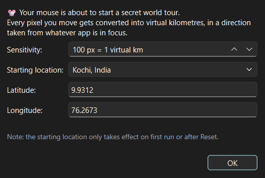
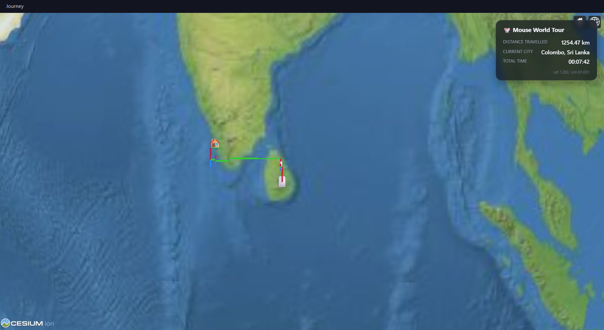
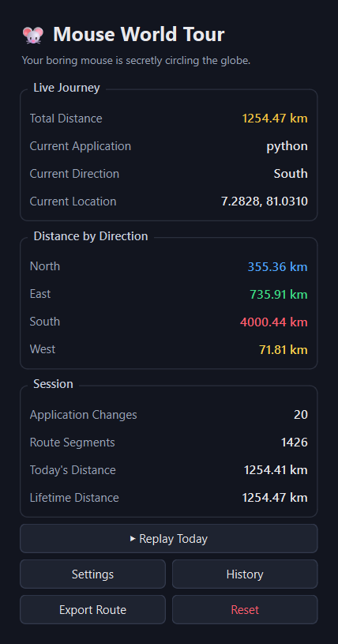

# Mouse World Tour


## Basic Details
### Team Name: USELESS


### Team Members
- Team Lead: ADITHYA NANDA GOPAL - MODEL ENGINEERING COLLEGE
- Member 2: MOHAMMED YASEEN - MODEL ENGINEERING COLLEGE

### Project Description
Mouse World Tour is a Windows tray app that quietly tracks how far you move
your mouse, converts that into virtual kilometres, and sends you on a
fictional trip around the Earth — direction is decided by whatever
application window you happen to be using. Your route is drawn live on a
spinning 3D globe.

### The Problem (that doesn't exist)
Nobody has ever needed to know how many kilometres or to where their mouse has
"travelled" while they browse Reddit and answer emails. This is exactly
that unnecessary information, delivered with unreasonable production
values.

### The Solution (that nobody asked for)
We turned ordinary mouse movement into a full navigation system: pixels
become kilometres, the app you're focused in becomes a compass direction
(Notepad → North, Chrome → East, whatever has an N/E/S/W in its title
wins), and your cursor's daily grind gets plotted as a real route — complete
with milestones ("Mouse Marathon" at 42.2 km, "Around the Earth" at
40,075 km), a replay feature, and GPX export so you can technically claim
your mouse has visited more countries than you have.

## Technical Details
### Technologies/Components Used
For Software:
- Languages: Python, JavaScript, HTML/CSS
- Frameworks/Libraries: PyQt6, PyQt6-WebEngine, Cesium.js, pywin32, psutil, matplotlib
- Tools: Cesium.js (offline Natural Earth II imagery, no API key needed), Windows system tray + a background-thread mouse poller


### Implementation
For Software:
# Installation
```bash
pip install -r requirements.txt
```

# Run
```bash
python main.py
```
or double-click `run.bat`. On first launch you'll get a one-time
calibration screen; after that the app lives in the system tray — click the
icon any time to open the World Tour globe.

### Project Documentation
For Software:

# Screenshots (Add at least 3)

*First-launch setup: pick your mouse sensitivity (pixels per virtual km) and starting city.*


*The live 3D globe: home marker, current position, and the route so far color-coded by direction (blue=N, green=E, red=S, yellow=W), with distance/city/time in the corner.*


*The detailed stats dashboard: total/lifetime/today distance, per-direction breakdown, app-change and route-segment counters.*


### Project Demo
# Video
[Add your demo video link here]
*Explain what the video demonstrates*

# Additional Demos
[Add any extra demo materials/links]


---
Made with ❤️ at TinkerHub Useless Projects 


